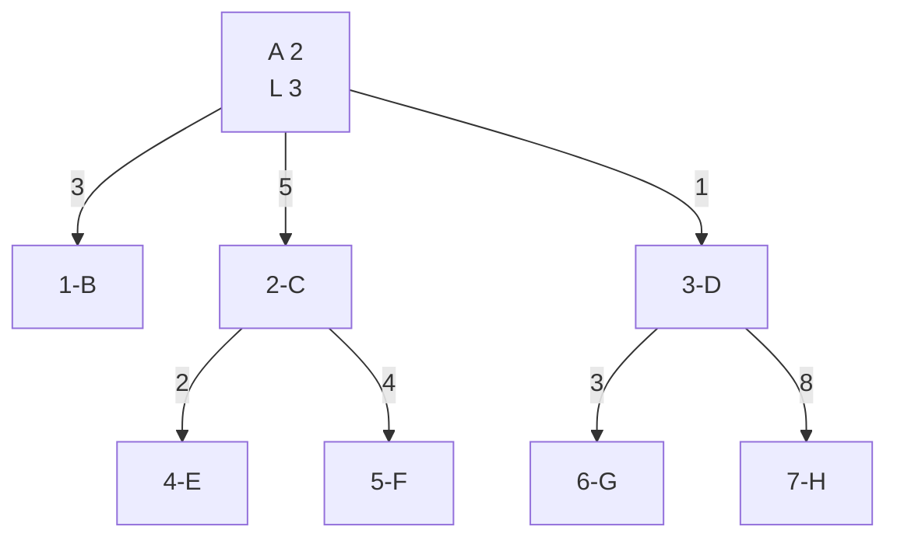

# File Processing
> A program that accepts one or more text files and creates a data stream on the disk that
answers specific questions related to the words. 
__Data Stream
* Index
* Dictionary

## Table of contents
* [General Info](#general-information)
* [Technologies Used](#technologies-used)
* [Features](#features)
* [Screenshots](#screenshots)
* [Room for Improvement](#room-for-improvement)
* [Setup](#setup)
* [Acknowledgements](#acknowledgements)

## General Information

The dictionary contains all the words in the texts accompanied by a number. Each word points to the Index.

## Technologies Used
Java Integrated Development Environment (IDE)

## Screenshots

## Setup

## Acknowledgements
- This project was created for the requirements of the lesson Data Structures.

