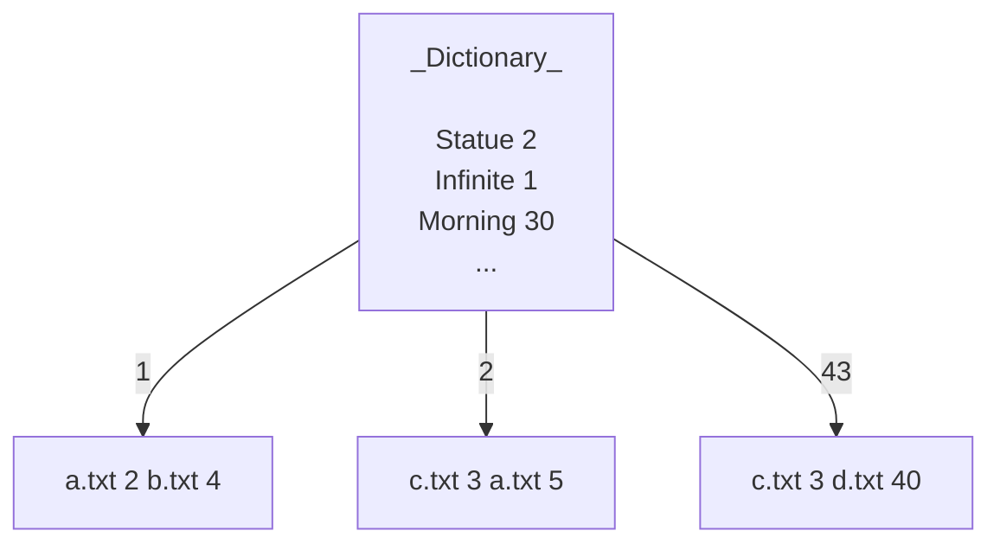

# File Processing
> A program that accepts one or more text files and creates a data stream on the disk that
answers specific questions related to the words.    

__Data Stream__
* Index
* Dictionary

## Table of contents
* [General Info](#general-information)
* [Technologies Used](#technologies-used)
* [Setup](#setup)
* [Acknowledgements](#acknowledgements)

## General Information
Τhe program performs the following operations:
* Construction of the data structure in the main memory
    * Structure of pairs of strings and number
* Construction of archive structure 
    * Sequence of pages(128 bytes) of pair string - integer
* Search the data structure
    * Binary search to an archive and calculation of costs per page[^1][^3] and disk[^2].  

The dictionary contains all the words in the texts accompanied by a number. Each word points to the index.  
The index is a file whose each page (128 bytes) stores pairs of the format __(filename – bytes locations from the beginning of the text)__. The pages link to each other when we have redundancy in a word.

## Technologies Used
Java Integrated Development Environment (IDE)

## Setup
To run this project, import project to IDE workshop.
Project contains samples of .txt files.

## Acknowledgements
- This project was created for the requirements of the lesson Data Structures.

[^1]: Search inside the page does not count disk access.
[^2]: Read page costs one disk access.
[^3]: Every reading page in the index also costs an access to the disk. 
