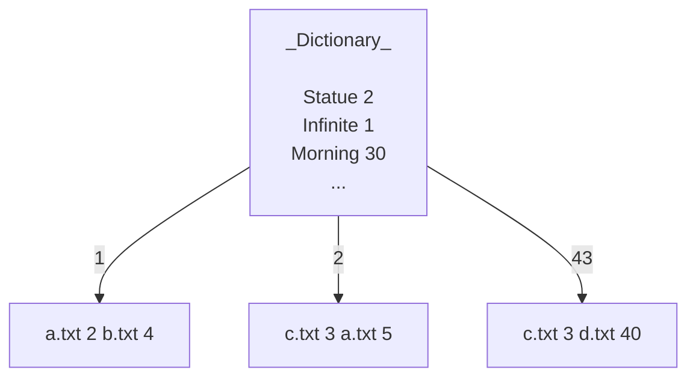
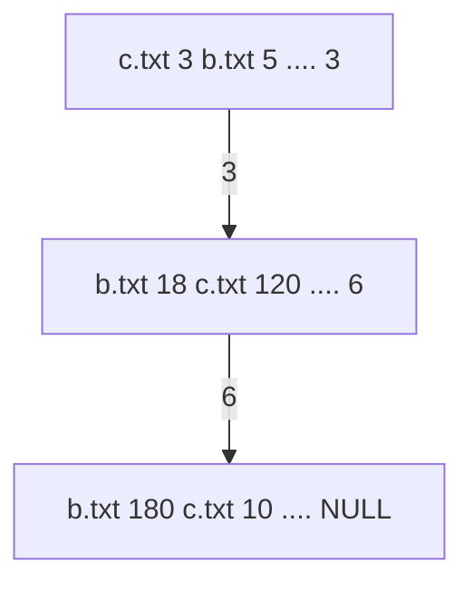

# File Processing
> A program that accepts one or more text files and creates a data stream on the disk that
answers specific questions related to the words.    

__Data Stream__
* Index
* Dictionary

## Table of contents
* [General Info](#general-information)
* [Technologies Used](#technologies-used)
* [Setup](#setup)
* [Acknowledgements](#acknowledgements)

## General Information
Τhe program performs the following operations:
* Construction of the data structure in the main memory
    * Structure of pairs of strings and number
* Construction of archive structure 
    * Sequence of pages(128 bytes) of pair string - integer
* Search the data structure
    * Binary search[^1] to the dictionary and calculation of costs per page[^2][^3] and disk[^4]  

The dictionary contains all the words in the texts accompanied by a number. Each word points to the index. Each page in the dictionary contains 5 pairs.
The number specifies the page in the index that corresponds to the word.  

The graph shows the connection between the files. In the graph, we see that the word infinite is in the file `a.txt` in position 2bytes from the beginning of the file.

The index is a file whose page (__128 bytes__) stores pairs of the format __(filename – bytes, locations from the beginning of the text)__. Each page in the index contains 4 pairs.
The pages link to each other when we have redundancy in a word.  

### Construction of the data structure in the main memory
We find all the words by reading all the input files and construct the
structure of the schema in the main memory.

 `Dictionary` is an sorted array with all the words that exist in the texts (each word appears once).

Each word is represented by a string and an integer(integer will be decide when you copy the structure to disk). Each word points to the `Index`. 

In main memory, `Index` is a `list`.

### Construction of archive structure 
File page => __128bytes__. 

Buffer in the main memory filled with `string - integer` pairs from the `Dictionary`.
When filled, we write a new page at the end of the file. 
Empty the buffer and we continue the same until the `Dictionary` in the file is copied.
The `Index` is a file whose each page stores pairs of the form (`filename - positions bytes` from the beginning of the text).  If a word exists
in the `Dictionary` then there is at least one page for it in the `Index`.
The Index consists of pages of __128bytes__ in size.

### Search the data structure
1. Read the middle page of the file by bringing it into main memory (costs one disk access). 
2. Search within the page you fetched (this does not cost a disk access). 
    * If you find it, the function returns the contents of the location
    * If you do not find it then read the middle page from the left or right side of the page.
3. Each page read costs one disk access.

## Technologies Used
Java Integrated Development Environment (Eclipse IDE)

## Setup
To run this project, import project to IDE workshop.
Project contains samples of .txt files.
The files have to follow the format that mentioned in [General Info](#general-information).

1. Clone repository
2. In EclipseIDE
    * File->Import->General->Projects from Folder
    * Select repository directory
    * Finish
3. Ready for testing

## Acknowledgements
- This project was created for the requirements of the lesson Data Structures.

[^3]: Search inside the page does not count disk access.
[^2]: Read page costs one disk access.
[^4]: Every reading page in the index also costs an access to the disk. 
[^1]: http://interactivepython.org/runestone/static/pythonds/SortSearch/TheBinarySearch.html
